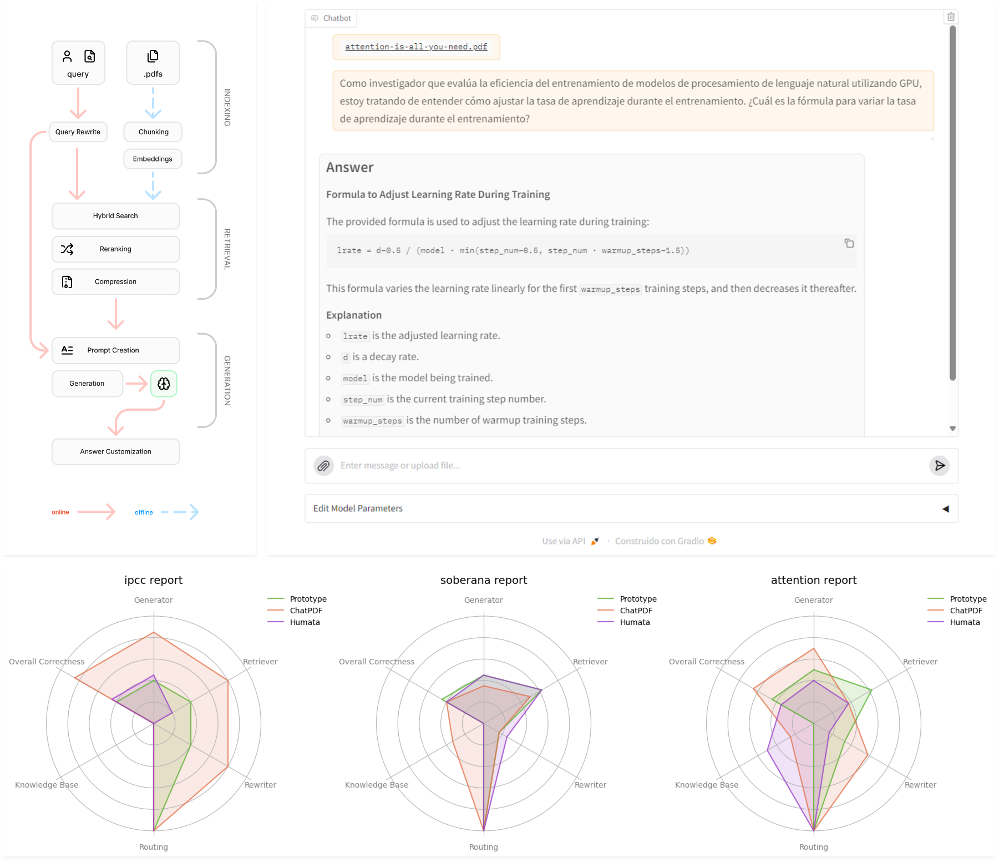

# Advanced RAG Pipeline 

<a href="https://colab.research.google.com/github/humankernel/rag/blob/main/notebooks/colab.ipynb" target="_parent"></a> <a href="https://rcci.uci.cu/?journal=rcci" target="_parent"></a>



## Overview 

This project is a prototype developed for a [research paper](https://rcci.uci.cu/) focused on democratizing AI tools for managing PDF documents in resource-limited contexts. It serves as an advanced Retrieval-Augmented Generation (RAG) pipeline example, showcasing how AI can facilitate document management.

## Features

- **Gradio UI**: An interactive user interface for easy interaction with the RAG pipeline.
- **Testing Framework**: Utilizes the RAGET library from Griskard to ensure robust testing of functionalities.
- **Advanced RAG Pipeline**: Demonstrates state-of-the-art techniques for document management and retrieval.


## Installation

To set up the project locally, follow these steps:

1. Clone the repository:

```bash
git clone https://github.com/humankernel/rag.git
cd rag
```

2. (Optional) Set up a virtual environment to manage dependencies:

```bash
python -m venv .venv
source .venv/bin/activate
```

3. Install the required dependencies:

```sh
pip install -U pip setuptools wheel
pip install -r requirements.txt
```

4. Or use [uv](https://github.com/astral-sh/uv)

```sh
uv sync

# uv will use the cuban national pypi repos 
# if you don't want this open the `pyproject.toml`
# and remove the following:
# [[tool.uv.index]]
# url = "http://nexus.prod.uci.cu/repository/pypi-all/simple"
# default = true
```

1. Open the notebook ([rag.ipynb](rag.ipynb))

## (Optional) Setup PyPi cuban repos

If your using uv you don't need to do this:

```ini
# edit
# linux: ~/.config/pip/pip.conf
# windows: ~\AppData\Roaming\pip\pip.ini

[global]
timeout = 120
index = http://nexus.prod.uci.cu/repository/pypi-all/pypi
index-url = http://nexus.prod.uci.cu/repository/pypi-all/simple
[install]
trusted-host = nexus.prod.uci.cu
```

## Usage

Since this is currently a prototype all of the main code is in a single jupyter notebook 

- [rag.ipynb](rag.ipynb): notebook with rag pipeline and evaluations
- [chunking.ipynb](notebooks/chunking.ipynb): exploration of different chunking strategies
- [indexing.ipynb](notebooks/indexing.ipynb): exploration of different indexing strategies
- [retrieval.ipynb](notebooks/retrieval.ipynb): exploration of different retrieval strategies
- [diagrams.ipynb](notebooks/diagrams.ipynb): code for creating the diagrams of the paper

## Contributing

Contributions are welcome! Please follow these steps:

1. Fork the repository.
2. Create a new branch (git checkout -b feature/YourFeature).
3. Make your changes and commit them (git commit -m 'Add some feature').
4. Push to the branch (git push origin feature/YourFeature).
5. Open a pull request.

## License
This project is licensed under the MIT License - see the LICENSE file for details
