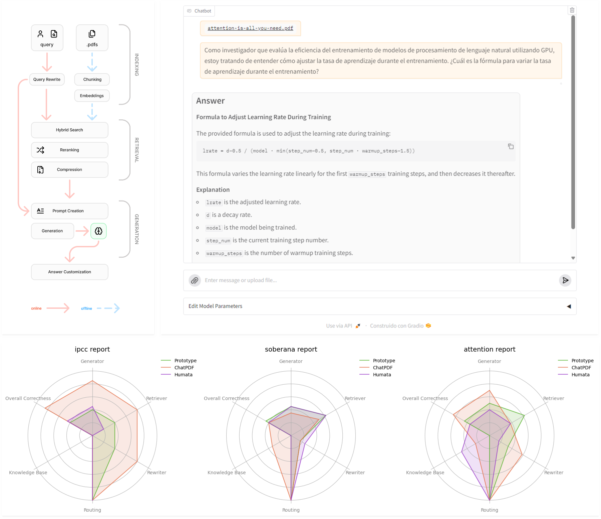

# Advanced RAG Pipeline

<a href="https://colab.research.google.com/github/humankernel/rag/blob/main/notebooks/colab.ipynb" target="_parent"></a>



## Features

- Gradio UI 
- Evaluation with sintetic tests (w/ Giskard)
- ...

## Getting Started

clone repo

```sh
git clone https://github.com/humankernel/rag.git
cd rag
```

setup python env

```sh
python -m venv .venv
source .venv/bin/activate.fish

pip install -U pip setuptools wheel
pip install -r requirements.txt
```

## Contributions
We welcome contributions to improve this tool! If you have ideas for optimization, bug fixes, or new features, feel free to get involved.

To contribute, follow these steps:

1. Fork the repository and clone your copy locally.
2. Create a new branch for your changes:

```bash
git checkout -b your-branch-name
```
 
3. Make the necessary changes and ensure your code is well-documented.
4. Run existing tests (or add new tests if you’ve introduced new functionality) to make sure everything works correctly.
5. Commit your changes:
```bash
git commit -m "Brief description of your changes"  
```
6. Push your changes to your remote repository:
```bash
git push origin your-branch-name  
```
7. Open a Pull Request from your branch to the repository’s main branch.

Please include a detailed description of the changes made in the Pull Request, and if applicable, provide examples or test cases to support your updates.

Thank you in advance for your interest in contributing! We look forward to collaborating with you to enhance this tool.


## pip uci repo

```
# linux: ~/.config/pip/pip.conf
# windows: ~\AppData\Roaming\pip\pip.ini

[global]
timeout = 120
index = http://nexus.prod.uci.cu/repository/pypi-all/pypi
index-url = http://nexus.prod.uci.cu/repository/pypi-all/simple
[install]
trusted-host = nexus.prod.uci.cu
